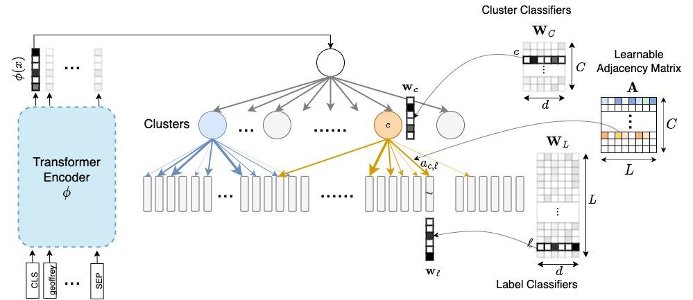

# ELIAS
<p align="center">
    <a href="https://arxiv.org/pdf/2210.08410.pdf">[paper]</a>&nbsp&nbsp&nbsp&nbsp&nbsp&nbsp&nbsp
    <a href="https://nilesh2797.github.io/docs/posters/ELIAS%20-%20poster.pdf">[poster]</a>&nbsp&nbsp&nbsp&nbsp&nbsp&nbsp&nbsp
    <a href="https://nilesh2797.github.io/docs/ppts/ELIAS-slides.pdf">[slides]</a>&nbsp&nbsp&nbsp&nbsp&nbsp&nbsp&nbsp
    <a href="">[video]</a>
</p>

Learnable graph-based search index for large output spaces
<p align="center"></p>

> [End-to-end Learning to Index and Search in Large Output Spaces](https://arxiv.org/pdf/2210.08410.pdf) <br>
> Nilesh Gupta, Patrick H. Chen, Hsiang-Fu Yu, Cho-Jui Hsieh, Inderjit S. Dhillon <br>
> Neurips 2022

## Highlights
- Fully learnable graph-based search index for classification in large output space
- Scalable to $\mathcal{O}(10M)$ label space on a single A100 GPU
- Achieves SOTA on multiple large-scale [extreme classification](http://manikvarma.org/downloads/XC/XMLRepository.html) benchmarks
## Preparing Data
The codebase assumes following data structure: <br>
<pre>
Datasets/
└── amazon-670k # Dataset name
    ├── raw
    │   ├── trn_X.txt # train input file, ith line is the text input for ith data point
    │   └── tst_X.txt # test input file, ith line is the text input for ith data point
    ├── X.trn.npz # train bow input features (needed to generate initial clustering)
    ├── Y.trn.npz # train relevance matrix (stored in scipy sparse npz format), num_train x num_labels
    └── Y.tst.npz # test relevance matrix (stored in scipy sparse npz format), num_test x num_labels
</pre>
Before running the training/testing the default code expects you to convert the input features to BERT's (or any text transformer) tokenized input indices. You can achieve that by running:
```shell
dataset="amazon-670k"
tf-max-len="128" # Use 32 for short-text datasets
tf-token-type="bert-base-uncased" # You can use any huggingface pre-trained tokenization
./prepare.sh ${dataset-name} ${tf-max-len} ${tf-token-type}
```
## Evaluating ELIAS
```shell
# Single GPU
python eval.py ${config_dir}/config.yaml

# Multi GPU
accelerate launch --config_file configs/accelerate.yaml --num_processes ${num_gpus} eval.py Results/ELIAS/${dataset}/${expname}/config.yaml
```
## Training ELIAS
Sample script: [run_benchmark.sh](./run_benchmark.sh) (example `./run_benchmark.sh amazon-670k`)
### *Generate initial clustering matrix*
```shell
python elias_utils.py gen_cluster_A configs/${dataset}/elias-1.yaml --no_model true
```
### *Train Stage 1*
```shell
# Single GPU
python train.py configs/${dataset}/elias-1.yaml

# Multi GPU
accelerate launch --config_file configs/accelerate.yaml --num_processes ${num_gpus} eval.py configs/${dataset}/elias-1.yaml
```
### *Generate sparse approx adjacency graph matrix*
```shell
# Single GPU
python elias_utils.py gen_approx_A configs/${dataset}/elias-1.yaml

# Multi GPU
accelerate launch --config_file configs/accelerate.yaml --num_processes ${num_gpus} elias_utils.py gen_approx_A configs/${dataset}/elias-1.yaml
```
### *Train Stage 2*
```shell
# Single GPU
python train.py configs/${dataset}/elias-2.yaml

# Multi GPU
accelerate launch --config_file configs/accelerate.yaml --num_processes ${num_gpus} eval.py configs/${dataset}/elias-2.yaml
```
## Download pretrained models
Coming soon...
## Notebook Demo
Coming soon...
## Cite
```bib
@InProceedings{ELIAS,
  author    = "Gupta, N. and Chen, P.H. and Yu, H-F. and Hsieh, C-J. and Dhillon, I.",
  title     = "End-to-end Learning to Index and Search in Large Output Spaces",
  booktitle = "Neural Information Processing Systems",
  month     = "November",
  year      = "2022"
}
```
